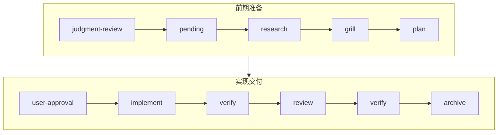

<p align="center">
  
</p>

<p align="center">
  <strong>🍥 让国产大模型在本地开发任务中按证据驱动的流程工作</strong><br/>
  <sub>基于 Trellis 与 grill-me 整合的工作流系统。</sub>
</p>

<p align="center">
  <a href="https://www.npmjs.com/package/mewoflow"></a>
  <a href="https://www.npmjs.com/package/mewoflow"></a>
  <a href="./LICENSE"></a>
  
</p>

## 安装

```bash
npm install -g mewoflow
```

## 升级：

```bash
npm install -g mewoflow && mewoflow update
```

`mewoflow update` 默认保留已有的项目说明和 skill 改动，只补齐缺失文件。`--force` 可强制覆盖模板。

## 快速开始

```bash
mewoflow init          # 初始化项目 wiring 与 hooks
```

向 Claude Code 提出开发任务后，MewoFlow 会按以下流程管控：




## 工作流门禁

`mewoflow check <gate>` 采用 **证据摘要模式**：CLI 会输出当前证据文件内容与工具追踪摘要，然后**立即推进该 gate**。Agent 须在确认证据充分后再运行 check；若证据不足，应先完善证据再执行 check。不再通过代码校验固定的 section 或字段。

| Gate                        | 用途                       | 关键证据                                                              |
| --------------------------- | -------------------------- | --------------------------------------------------------------------- |
| `pending-task-confirmation` | 判断任务类型，等待用户确认 | `accept-judgment --classification <simple\|standard\|epic>`、`reject-judgment`、`propose-task`、`confirm-task` |
| `research`                  | 获取最新资料和上下文       | `research.md`：搜索/工具/skill 证据；需先 `spec-skip` 或 `spec-create` |
| `grill`                     | 使用 `grill-me` 追问需求   | `grill.md`：提问日志、决策覆盖、锁定决策、验收标准、停止理由          |
| `plan`                      | 编写实现计划               | `plan.md`：快捷方案扫描、MVP 切片、阶段、风险、验证方式               |
| `user-approval`             | 用户批准计划后才能实现     | `approve-plan --prompt "..."`                                         |
| `implement`                 | 允许修改代码               | 计划已批准 + 已读取规则；hooks 动态发现 `.claude/skills/` 本地 skill，编辑前后端文件前须先读取/调用匹配 skill（PreToolUse 硬拦，PostToolUse 软提醒） |
| `verify`                    | 验证实现                   | `verify.md`：命令输出、关键链路证据、review 后复验                    |
| `review`                    | 代码 review（LLM 审查）    | `review.md`：逐文件 review；需返工时运行 `mewoflow rework` 而非阻塞 check |
| `archive`                   | 归档任务                   | `archive.md` + `approve-archive --prompt "..."`；未解决高危风险需 `approve-deferred-risk` |

证据文件（`research.md`、`grill.md`、`plan.md`、`verify.md`、`review.md`、`archive.md`）由 LLM 自由编写，**无固定 section 结构**；gate 推进依赖 LLM 审查证据是否充分。

## 常用命令

```bash
mewoflow status
mewoflow doctor

# 判断与任务确认
mewoflow accept-judgment --classification <simple|standard|epic> --session <id>
mewoflow reject-judgment --reason "..." --session <id>
mewoflow propose-task --title "..." --slug "..." --session <id>
mewoflow confirm-task --session <id>
mewoflow cancel-task --session <id>
mewoflow spec-skip --session <id>
mewoflow spec-create --session <id>

# Gate 推进
mewoflow check research
mewoflow check grill
mewoflow check plan
mewoflow approve-plan --prompt "..." --session <id>
mewoflow check implement
mewoflow check verify
mewoflow check review
mewoflow rework --reason "..." --session <id>
mewoflow approve-deferred-risk --reason "..." --session <id>
mewoflow approve-archive --prompt "..." --session <id>
mewoflow check archive

# 拆分与提交
mewoflow split-task --from-plan
mewoflow commit --message "chore: update workflow"

# 异常跳过
mewoflow override <gate> --reason "..."
```

## 项目结构

```txt
AGENTS.md                          # 跨 Agent 说明
CLAUDE.md                          # Claude Code 项目记忆

.mewoflow/
  rules.md / workflow.md / journal.md
  specs/                           # coding / testing / agent 规范
  tasks/<date>-<slug>/             # research → grill → plan → verify → review → archive
  archive/<task-id>/               # 已归档任务
  runtime/                         # hook runtime + sessions

.claude/
  settings.json                    # hook wiring
  skills/mewoflow/、grill-me/      # Claude Code skills
```

## Hooks

| Hook               | 职责                                                 |
| ------------------ | ---------------------------------------------------- |
| `UserPromptSubmit` | 拦截新请求，创建 pending judgment，引导显式 CLI 推进 |
| `PreToolUse`       | 阻止未确认时改代码/脚手架/安装依赖，保护状态文件     |
| `PostToolUse`      | 记录文件读取、搜索与命令执行                         |
| `Stop`             | 任务未完成时阻止 AI 直接结束                         |

### Claude Code Agent Teams（多 Agent）

Claude Code 2026 的 **Agent Teams** 支持并行多个 Claude Code 会话协作。MewoFlow 默认会在 `.claude/settings.json` 中一并 wiring 下列团队 hook（即使未启用 Agent Teams 也不影响）：

- `TeammateIdle`
- `TaskCreated`
- `TaskCompleted`

#### 前置条件

1. 全局或项目已安装 MewoFlow：`npm install -g mewoflow && mewoflow update`
2. 项目已初始化：`mewoflow init`（或 `/mewoflow`）
3. 健康检查通过：`mewoflow doctor`
4. 在 `~/.claude/settings.json` 或项目 `.claude/settings.json` 启用 Agent Teams：

```json
{
  "env": {
    "CLAUDE_CODE_EXPERIMENTAL_AGENT_TEAMS": "1"
  }
}
```

#### 开发期多 Agent 工作流（implement / verify / review）

**原则**：research → grill → plan 由 **Lead（主会话）** 单独完成；`approve-plan` 之后才并行拉队友。

```txt
Lead: judgment → research → grill → plan → approve-plan → check plan → implement
                                                              ↓
                    ┌─────────────────────────────────────────┴──────────────────────────┐
                    │ 并行（implement 门禁内，文件互不重叠）                              │
                    │  Explore 队友：只读搜代码/文档，不写实现文件                         │
                    │  Implement 队友 A：src/api/**                                        │
                    │  Implement 队友 B：src/ui/**                                         │
                    │  Lead：合并、改共享文件（路由/导出/配置）、跑 mewoflow check         │
                    └────────────────────────────────────────────────────────────────────┘
                                                              ↓
Lead: verify → review → verify → archive（可拉 Review 队友只读审查，由 Lead 写 review.md）
```

**逐步操作**

1. Lead 走完前期门禁直到 `approve-plan`，运行 `mewoflow check plan` 进入 `implement`。
2. Lead 按 `plan.md` 切片，为每个队友声明**独占路径**（目录或文件），再创建 Agent Team 任务。
3. 队友首次改代码前须已读 `.mewoflow/rules.md` 与任务目录下的 `research.md`、`grill.md`、`plan.md`（PreToolUse 会拦截未读就写）。
4. 队友完工后向 Lead 汇报：改了哪些文件、摘要、未决问题；**不要**自行 `mewoflow check`。
5. Lead 合并后写 `verify.md`，`mewoflow check verify`；review 阶段可派队友审查，但返工须 Lead 执行 `mewoflow rework`，队友不在 review 门禁改代码。
6. 全部完成后 Lead 写 `archive.md` 并 `approve-archive` → `check archive`。

**谁跑哪些命令**

| 角色 | 允许 | 禁止 |
| ---- | ---- | ---- |
| Lead | `check`、`approve-plan`、`rework`、`approve-archive`、`split-task` | — |
| 队友 | `status`、只读工具、分配路径内的 implement 写入 | 推进 gate、批准计划、改他人文件 |

**常见坑**

- 未 `approve-plan` 就拉 implement 队友 → PreToolUse 拒绝写代码。
- 两队友改同一文件 → 冲突与合并风险；共享文件留给 Lead。
- 队友跑 `mewoflow check` → 会话状态分裂，门禁应由 Lead 统一推进。
- 不同 `--session` 未对齐 → 用 Lead 的 session 作为唯一 workflow 源。

更完整的角色说明见项目根目录 `AGENTS.md`（`mewoflow update --force` 可刷新模板）。

## 故障排查

- 看不到 hook 提示 → 运行 `/mewoflow` 或 `mewoflow doctor`
- Claude 想直接创建项目 → 确保已完成 `judgment-review → confirm-task → research → grill → plan → approve-plan`
- 已确认但仍卡在待确认任务 → 运行 `mewoflow confirm-task --session <id>`（不要手动创建目录）
- `grill-me` 缺失 → 运行 `mewoflow update` 或 `mewoflow init` 重新生成
