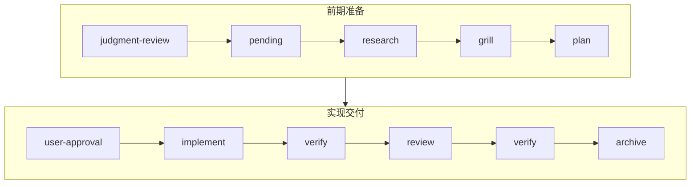

<p align="center">
  
</p>

<p align="center">
  <strong>🍥 让国产大模型在本地开发任务中按证据驱动的流程工作</strong><br/>
  <sub>基于 Trellis 与 grill-me 整合的工作流系统。</sub>
</p>

<p align="center">
  <a href="https://www.npmjs.com/package/mewoflow"></a>
  <a href="https://www.npmjs.com/package/mewoflow"></a>
  <a href="./LICENSE"></a>
  
</p>

## 安装

```bash
npm install -g mewoflow
```

## 升级：

```bash
npm install -g mewoflow && mewoflow update
```

`mewoflow update` 默认保留已有的项目说明和 skill 改动，只补齐缺失文件。`--force` 可强制覆盖模板。

## 快速开始

```bash
mewoflow init          # 初始化项目 wiring 与 hooks
```

向 Claude Code 提出开发任务后，MewoFlow 会按以下流程管控：




## Workflow Gates

| Gate                        | 用途                       | 关键证据                                                              |
| --------------------------- | -------------------------- | --------------------------------------------------------------------- |
| `pending-task-confirmation` | 判断任务类型，等待用户确认 | `accept-judgment` / `reject-judgment`、`propose-task`、`confirm-task` |
| `research`                  | 获取最新资料和上下文       | `## Tool Evidence`（WebSearch/WebFetch/MCP/skill）                    |
| `grill`                     | 使用 `grill-me` 追问需求   | 提问日志、决策覆盖、锁定决策、验收标准、停止理由                      |
| `plan`                      | 编写实现计划               | 快捷/现成方案扫描、MVP 切片、阶段、风险、验证方式                     |
| `user-approval`             | 用户批准计划后才能实现     | `approve-plan --prompt "..."`                                         |
| `implement`                 | 允许修改代码               | 计划已批准 + 已读取规则                                               |
| `verify`                    | 验证实现                   | 命令输出、关键链路证据、review 后复验                                 |
| `review`                    | 代码 review                | 逐文件 review、严重级别；高危需 `mewoflow rework` 退回                |
| `archive`                   | 归档任务                   | 总结、验证结果、review 结论；未解决高危风险需 `approve-deferred-risk` |

## 常用命令

```bash
mewoflow status
mewoflow doctor

# 判断与任务确认
mewoflow accept-judgment --session <id>
mewoflow reject-judgment --reason "..." --session <id>
mewoflow propose-task --title "..." --slug "..." --session <id>
mewoflow confirm-task --session <id>
mewoflow cancel-task --session <id>

# Gate 推进
mewoflow check research
mewoflow check grill
mewoflow check plan
mewoflow approve-plan --prompt "..." --session <id>
mewoflow check implement
mewoflow check verify
mewoflow check review
mewoflow rework --reason "..." --session <id>
mewoflow approve-deferred-risk --reason "..." --session <id>
mewoflow check archive

# 拆分与提交
mewoflow split-task --from-plan
mewoflow commit --message "chore: update workflow"

# 异常跳过
mewoflow override <gate> --reason "..."
```

## 项目结构

```txt
AGENTS.md                          # 跨 Agent 说明
CLAUDE.md                          # Claude Code 项目记忆

.mewoflow/
  rules.md / workflow.md / journal.md
  specs/                           # coding / testing / agent 规范
  tasks/<date>-<slug>/             # research → grill → plan → verify → review → archive
  archive/<task-id>/               # 已归档任务
  runtime/                         # hook runtime + sessions

.claude/
  settings.json                    # hook wiring
  skills/mewoflow/、grill-me/      # Claude Code skills
```

## Hooks

| Hook               | 职责                                                 |
| ------------------ | ---------------------------------------------------- |
| `UserPromptSubmit` | 拦截新请求，创建 pending judgment，引导显式 CLI 推进 |
| `PreToolUse`       | 阻止未确认时改代码/脚手架/安装依赖，保护状态文件     |
| `PostToolUse`      | 记录文件读取、搜索与命令执行                         |
| `Stop`             | 任务未完成时阻止 AI 直接结束                         |

## Troubleshooting

- 看不到 hook 提示 → 运行 `/mewoflow` 或 `mewoflow doctor`
- Claude 想直接创建项目 → 确保已完成 `judgment-review → confirm-task → research → grill → plan → approve-plan`
- 已确认但仍卡在 pending task → 运行 `mewoflow confirm-task --session <id>`（不要手动建目录）
- `grill-me` 缺失 → 运行 `mewoflow update` 或 `mewoflow init` 重新生成
